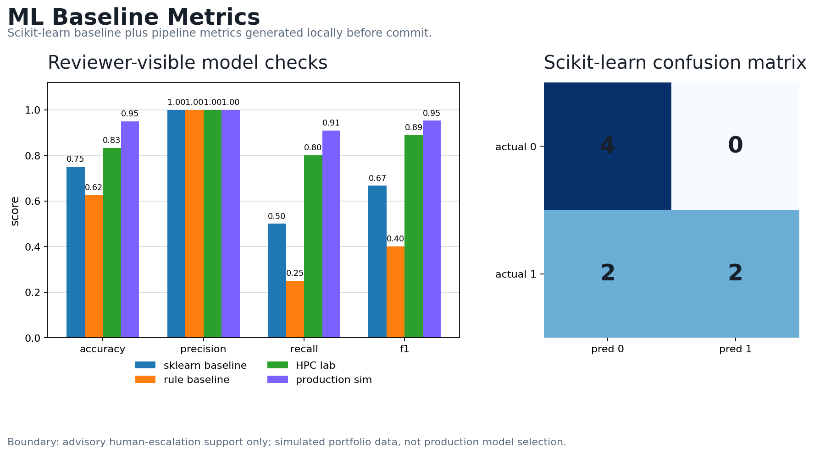
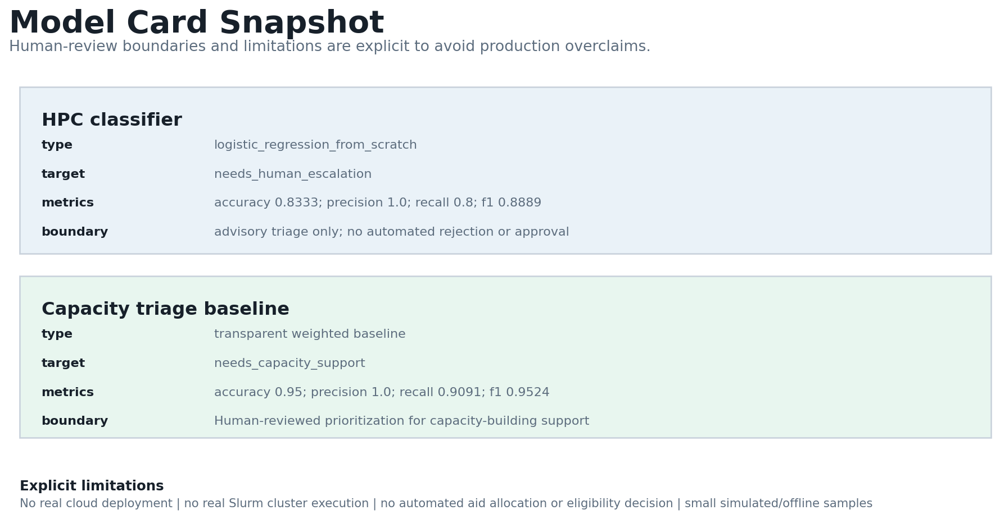
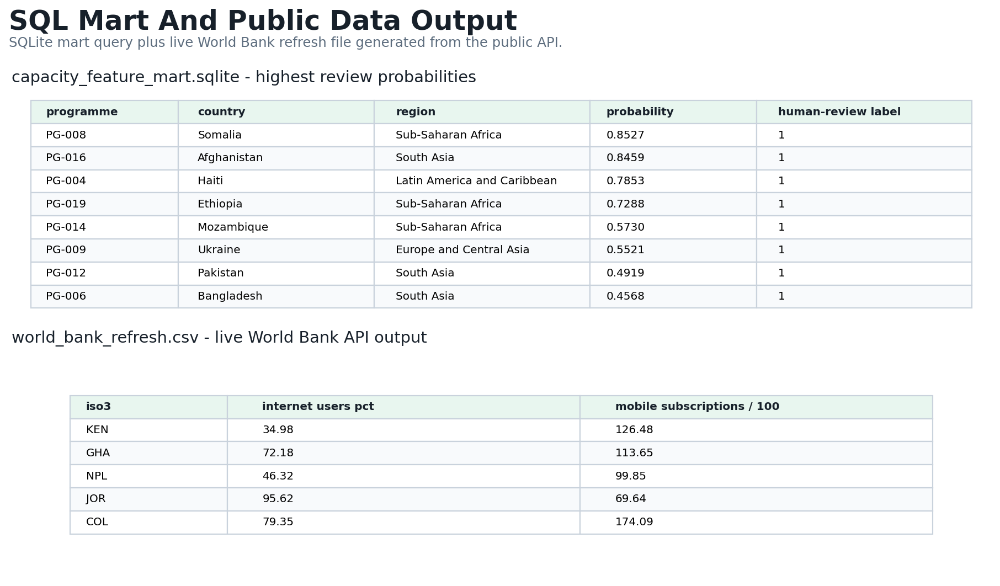
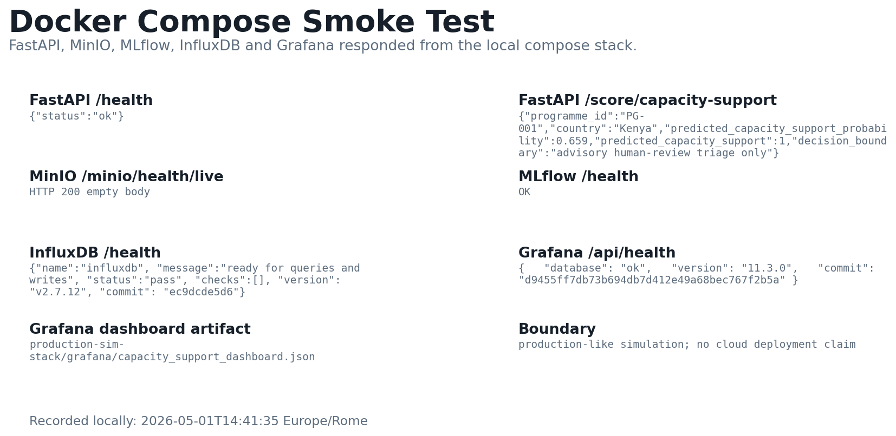

[`Static demo on GitHub Pages`](https://errer441122.github.io/regulated-ai-governance-cockpit/)
[`Live API on Render`](https://regulated-ai-governance-api.onrender.com/docs)
[](https://errer441122.github.io/regulated-ai-governance-cockpit/)
[](https://regulated-ai-governance-api.onrender.com/docs)
[](https://github.com/errer441122/regulated-ai-governance-cockpit/actions/workflows/validate.yml)

# Regulated AI Governance & ML Engineering Cockpit

## Evidence Lock v1.0

This repository is an applied AI/data governance portfolio project with executable evidence.

### What is executable

- Python/scikit-learn ML baseline
- Public-data GiveMeSomeCredit credit-risk lab
- SQL/DuckDB feature marts
- Data-quality and drift checks
- Calibration and model-card artifacts
- FastAPI-compatible scoring simulation
- Live Render API proof-of-execution
- Deploy-ready Docker FastAPI service with Render Blueprint
- NIST AI RMF / EU AI Act / ISO 42001 public governance pack
- Docker smoke test evidence
- Public-data SDG/GIS lab
- Slurm-ready batch packaging
- PyTorch-compatible CPU benchmark for AI/HPC readiness

### Reproduce

```bash
make setup
make evidence
```

Evidence report: `evidence-lock/results/portfolio_evidence_report.md`

Scope boundaries: this is not a production system, not a legal compliance tool, not a credit model, not an aid-allocation tool, and not a real CINECA/IT4LIA/CRIF/PwC/UNDP/BI-REX deployment. The Render API is a public portfolio deployment, not a production cloud system.

## Technical evidence

Primary stack: Python, scikit-learn, SQL/DuckDB, FastAPI-compatible API, Docker, Render Blueprint, Slurm-ready batch scripts.

Run:

```bash
make setup
make test
make train
make smoke
```

## Portfolio positioning

Responsible AI governance and ML engineering simulation for regulated decision support, combining a static governance cockpit with executable Python, scikit-learn, SQL, FastAPI-style, Slurm-ready, public-data, and AI Factory/HPC evidence.

Best for: CRIF ML Engineering / PwC Data & AI and Risk / UNDP Digital and Data Science / CINECA and IT4LIA AI Factory readiness.

What is executable: `npm test`, `python ml-baseline/train_model.py`, `python orchestration/local_orchestrator.py`, `python undp-sdg-risk-lab/src/run_pipeline.py`, `python hpc-ai-rag-lab/src/benchmark.py --quick`.

What is simulated: commercial cockpit data, synthetic portfolio labels, production stack, Docker/cloud context, Slurm/HPC/AI Factory access, and employer/client use. The credit-risk lab uses the public OpenML curation of GiveMeSomeCredit.

Start here if you have 5 minutes: `docs/reviewer/RECRUITER_5_MIN_ROUTE.md`.

This is a static portfolio case with local executable labs and a public Render API proof-of-execution. It is not a production CRM, legal compliance tool, credit model, aid allocation tool, real AI product, production cloud deployment, or real Slurm/HPC execution. It uses simulated commercial data, synthetic risk labels, public-development-style samples, public credit-risk data, and public-company assumptions to demonstrate business logic, workflow design, ML engineering, and operating structure.

## Best reviewed for

| Role | Evidence | What not to claim |
| --- | --- | --- |
| CRIF ML Engineering | `credit-risk-model-risk-lab/`, `ml-baseline/`, `orchestration/`, `production-sim-stack/src/ml_model_adapter.py`, `sql/`, `hpc/` | No real CRIF data, no production cloud/SaaS deployment |
| PwC Data & AI / Risk | Public credit-risk metrics, governance pack, ML model card, calibration/drift artifacts, SQL marts, cockpit narrative, `EVIDENCE_MAP.md` | No client delivery, no production risk model |
| UNDP Digital/Data Science | `undp-sdg-risk-lab/`, `production-sim-stack/PUBLIC_SECTOR_SDG_ROUTE.md`, responsible data checklist | Not a real UNDP project or country-office deployment |
| CINECA / IT4LIA | `hpc-ai-rag-lab/`, `ai-factory-workload-pack/`, Slurm scripts, Apptainer recipes | No real cluster, GPU, Leonardo, or AI Factory run |
| BI-REX supplement | `production-sim-stack/`, `hpc-mlops-industrial-lab/`, monitoring artifacts | Ducati repo is stronger for industrial telemetry |

## Reviewer routes

- 5-minute recruiter route: `docs/reviewer/RECRUITER_5_MIN_ROUTE.md`
- 20-minute technical route: `docs/reviewer/TECHNICAL_20_MIN_ROUTE.md`
- Claims and limitations: `docs/reviewer/CLAIMS_AND_LIMITATIONS.md`
- Company fit matrix: `docs/reviewer/COMPANY_FIT_MATRIX.md`

## Interactive AI Business Implementation Case Study

The cockpit shows how a regulated organization could structure GenAI adoption planning, data-driven workflow analytics, risk-aware operational decision support, product documentation, and capacity-building material for responsible AI adoption.

## Why I built it

I built this project to show how I think about enterprise AI implementation from a non-engineering angle:

- account prioritization
- data-driven prioritization
- pipeline and workflow governance
- weighted forecasting
- bottleneck diagnosis
- Sales-to-Customer Success handoff
- stakeholder alignment
- adoption planning
- responsible AI guardrails
- training and knowledge-product design
- product framing

The goal is to make one project readable from four angles:

- `Data / Analytics / Risk`: scoring, data-quality assumptions, risk labels, weighted logic, and transparent methodology
- `AI Adoption / Governance`: stakeholders, rollout, training, guardrails, and KPI tracking
- `Commercial Operations`: CRM logic, forecast discipline, handoff, and bottlenecks
- `AI Product Thinking`: users, stories, MVP scope, backlog, and product metrics

## How to review this project

If you are reviewing this for:

- `Data / Analytics / Risk`: start with `Case Study Brief`, `Data Workflow Cockpit`, and `Methodology`
- `Digital AI Governance / Public Innovation`: start with `Case Study Brief`, `Adoption & Governance`, `Training Material Example`, and `Methodology`
- `CINECA / IT4LIA`: start with `CINECA_IT4LIA_REVIEWER_ROUTE.md`
- `UNDP Digital, AI and Innovation`: start with `UNDP_REVIEWER_ROUTE.md`
- `Commercial Operations / RevOps`: start with `Data Workflow Cockpit`
- `AI Product / Product Ops`: start with `Product Brief` and `Methodology`
- `CRIF / PwC / BI-REX`: start with `AI_INTERNSHIP_FIT.md`, `EVIDENCE_MAP.md`, `technical-lab/`, and `ai-factory-workload-pack/`
- `CRIF ML Engineering / PwC / BI-REX technical screening`: start with `ml-baseline/`, `sql/`, `hpc/`, `hpc-mlops-industrial-lab/`, `production-sim-stack/`, and `ai-factory-workload-pack/`

## For Data, AI Governance, and Innovation Reviewers

If you only have a few minutes, review these sections in order:

1. `Case Study Brief`
2. `Regulated Account Scoring`
3. `Adoption & Governance`
4. `Training Material Example`
5. `LLM-Assisted Account Brief Simulator`
6. `Governance Checklist PDF export`
7. `Methodology`

## Additional technical portfolio evidence

`technical-lab/` is a compact mini project for AI/data consulting and AI Factory-style roles. It includes a Python/pandas CSV validation pipeline, generated reports, a notebook outline, an n8n workflow export, and a human-reviewed agentic brief generator.

`ai-data-agentic-readiness-lab/` is the extended version with tests and a static reviewer dashboard.

`hpc-mlops-industrial-lab/` is the technical upgrade for roles asking for ML, MLOps, SQL/data engineering, text mining, GIS-lite features, Slurm/HPC readiness, and industrial AI signals. It includes a runnable Python classifier, SQLite feature mart, model card, metrics, Slurm batch script, and Airflow/Dagster adapter sketches.

`production-sim-stack/` packages the case as a production-like local simulation with FastAPI-compatible scoring, a live Render API, Docker Compose, a deploy-ready API Dockerfile, Render Blueprint support, MLflow-style run metadata, MinIO/S3-style artifact manifest, DuckDB mart SQL, Influx/Grafana monitoring artifacts, Slurm job array, architecture notes, smoke-test documentation, and a World Bank/HDX-style public-data path for UNDP.

`credit-risk-model-risk-lab/` is the public-data CRIF/PwC upgrade. It uses the OpenML curation of the original Give Me Some Credit dataset, trains credit-risk baselines, and writes ROC-AUC, PR-AUC, Gini, KS, Brier score, expected calibration error, PSI, calibration, drift, model-card, and model-risk framework artifacts.

`governance/` is the structured audit pack. It maps the portfolio to public NIST AI RMF functions, EU AI Act themes, and high-level ISO/IEC 42001 management-system gaps without copying proprietary controls or claiming certification.

`ml-baseline/` is a reviewer-visible synthetic Risk ML Lab for CRIF/PwC-style ML screening. It uses OOP-style components, trains Logistic Regression and RandomForest baselines, writes ROC-AUC/PR-AUC/F1/Brier/calibration/drift artifacts, saves a local `model.joblib` artifact when joblib is available, and keeps the decision boundary advisory.

`production-sim-stack/src/ml_model_adapter.py` bridges the reviewer ML baseline into the production simulation: it loads `ml-baseline/artifacts/model.joblib` when present and falls back to the transparent rule baseline when the artifact is absent.

`orchestration/` is a local Dagster-equivalent path. It decomposes the work into validation, ML training, production simulation, and public-data/RAG checks without claiming a real Dagster or Airflow deployment.

`undp-sdg-risk-lab/` is an offline-first public-data mini lab for UNDP-style review. It uses public-development-style sample indicators, lightweight text mining, a responsible data checklist, and a short policy note.

`hpc-ai-rag-lab/` is a CPU-friendly retrieval/RAG workload for CINECA/IT4LIA review. It includes TF-IDF retrieval, an extractive answer stub, local benchmark artifact, Slurm script, and Apptainer recipe, with an explicit no-real-cluster boundary.

`ai-factory-workload-pack/` is a compact CINECA/IT4LIA reviewer pack with a workload manifest, data management plan, FAIR-style metadata example, benchmark plan, and Apptainer recipe. It shows AI Factory/HPC workload thinking without claiming real cluster execution.

`sql/` and `hpc/` are top-level shortcuts for reviewers looking specifically for DWH/SQL and Slurm evidence without browsing the deeper lab folders.

`AI_INTERNSHIP_FIT.md` is the strict recruiter-facing fit review for CRIF, PwC, UNDP, CINECA, IT4LIA, and BI-REX. It also states what not to claim.

## Technical result screenshots

These generated images give fast technical reviewers a visual shortcut to the executable evidence.









Best fit:

- CRIF AI/Data/Agentic Solutions
- PwC Data & AI Consulting
- UNDP Digital, AI and Innovation
- CINECA / IT4LIA AI Factory and HPC support roles
- BI-REX as supplemental data-engineering/HPC evidence only

## Recruiter Fit Snapshot

### Data, analytics, and risk roles

This project is strongest for data, analytics, and risk screening because it demonstrates business information thinking, regulated-sector awareness, data-quality assumptions, scoring logic, weighted decision support, risk labels, governance boundaries, and ML-adjacent workflow design without claiming production model ownership.

Relevant evidence:

- structured and unstructured information workflows
- account scoring and weighted forecast logic
- risk, compliance, privacy, security, and procurement labels
- regulated-sector, public administration, utilities, and infrastructure examples
- GenAI brief workflow with approved-data inputs and human review
- methodology section that separates simulated data from public-company assumptions

### Digital, AI, and innovation roles

This project is also relevant for digital, AI, and innovation screening when framed as a responsible AI adoption and programme-support case study rather than a sales project.

Relevant evidence:

- stakeholder mapping and rollout planning
- governance guardrails and escalation logic
- training material, workshop agenda, and learning objectives
- dashboards, trackers, SOP/checklist writing, and reusable knowledge products
- responsible data-use framing and human-in-the-loop review
- clear limitations, transparency, and methodology discipline

## What it demonstrates

- weighted account scoring for regulated enterprise targets
- total pipeline versus weighted pipeline forecast logic
- stage probabilities and explicit exit criteria
- bottleneck analysis tied to concrete Commercial Ops actions
- Sales-to-Customer Success handoff design
- AI-assisted account brief simulation with human-review framing
- stakeholder map and adoption rollout plan
- governance guardrails and training plan
- workshop agenda, learning objectives, and five-slide training material example
- mini PRD structure with users, stories, MVP boundaries, metrics, and backlog
- transparent methodology and explicit project limits
- prompt-structured workflow support with human review positioning
- recruiter-readable evidence for data/risk and digital AI governance internships

## Main sections

1. `Overview`
   Positioning, KPI cards, disclaimer, executive insights, and four review paths.
2. `Decision Demo`
   A navigable use-case queue that walks through governance gates, blockers, decisions, and reviewer-visible artifacts before opening the cockpit.
3. `Case Study Brief`
   Recruiter-friendly summary of context, problem, solution, role, outputs, and next iteration.
4. `Data Workflow Cockpit`
   Forecast, pipeline, scoring, brief simulator, playbook, and diagnostics.
5. `Adoption & Governance`
   Stakeholders, rollout, guardrails, training plan, consulting deliverables, and adoption KPIs.
6. `Product Brief`
   Problem statement, users, stories, MVP scope, metrics, backlog, and decision log.
7. `Methodology`
   Assumptions, simulated elements, limitations, and what would change with real CRM data.
8. `EVIDENCE_MAP.md`
   Role-by-role map from job requirements to project evidence.
9. `technical-lab/`
   Python/pandas validation, readiness scoring, notebook outline, n8n-style workflow export, and a human-reviewed agentic brief generator.

## My role

I designed the business logic, scoring framework, workflow structure, and governance assumptions behind the cockpit.

AI-assisted development was used to accelerate coding and iteration, while the commercial logic, product structure, and use case design were defined independently.

## Methodology

The project uses simulated data for:

- pipeline values
- deal stages
- stage probabilities
- weighted pipeline
- stage age
- risk labels
- PoC readiness
- fit scores
- AI-assisted brief outputs

It also uses public-company assumptions for selected real organization names and broad sector logic. It does not represent confidential data, internal pipeline information, or real customer evaluations.

## Stack

- HTML
- CSS
- Vanilla JavaScript
- Python
- pandas
- Chart.js via CDN
- jsPDF via CDN
- jsPDF AutoTable via CDN
- Font Awesome via CDN
- Google Fonts via CDN

The main cockpit is static and has no backend, authentication, live CRM integration, or live AI API.
The technical labs include local/simulated backend, SQL, Docker, Slurm, and ML lifecycle evidence for reviewer evaluation only.

## Automation positioning

The automation layer is intentionally cross-platform. It includes examples that could be implemented with:

- `n8n` / `Make` / `Zapier` for event-driven notifications and scheduled digests
- `Power Automate` for approvals, reminders, and traceable governance routing
- `Copilot Studio` for post-training FAQ support and human-escalation flows

## Local run

Open `index.html` in a browser.

Because external libraries are loaded via CDN, internet access is required for charts, icons, and PDF export.

Run the dataset validator with:

```bash
npm test
```

The validator checks dataset references, scoring weights, navigation targets, the decision-demo wiring, computed total versus weighted pipeline values, and the executable HPC/MLOps lab.

Run only the static validator with:

```bash
npm run test:node
```

Run only the HPC/MLOps lab with:

```bash
npm run test:hpc
python hpc-mlops-industrial-lab/src/run_pipeline.py
```

Run only the production simulation stack with:

```bash
npm run test:prod-sim
python production-sim-stack/src/orchestrate.py
```

Run the scikit-learn ML baseline with:

```bash
python -m pip install -r ml-baseline/requirements.txt
python ml-baseline/train_model.py
python -m pytest -q ml-baseline/tests
```

Run the local orchestration path with:

```bash
python orchestration/local_orchestrator.py
```

Run the UNDP SDG/public-data lab with:

```bash
python undp-sdg-risk-lab/src/run_pipeline.py
python -m pytest -q undp-sdg-risk-lab/tests
```

Run the CINECA/IT4LIA retrieval workload with:

```bash
python hpc-ai-rag-lab/src/benchmark.py --quick
python -m pytest -q hpc-ai-rag-lab/tests
```

The GitHub Action runs the dataset validator, Python tests, production simulation pipeline, scikit-learn baseline, local orchestration, UNDP lab, and HPC/RAG benchmark.

Docker smoke test evidence:

- Local compose stack: `production-sim-stack/docker-compose.yml`
- Recorded smoke-test notes: `evidence/docker-smoke-test.md`
- Recorded smoke-test JSON: `evidence/docker-smoke-test.json`
- Visual API/service evidence: `evidence/technical-screenshots/docker-api-smoke.png`

The local smoke test started FastAPI, MLflow, MinIO, InfluxDB, and Grafana with Docker Compose. It verified FastAPI `/health`, FastAPI `/score/capacity-support`, MinIO health, MLflow health, InfluxDB health, and Grafana health. This remains a production-like local simulation.

Cloud deployment evidence:

- Live API docs: `https://regulated-ai-governance-api.onrender.com/docs`
- Live health check: `https://regulated-ai-governance-api.onrender.com/health`
- Deployment guide: `README_DEPLOYMENT.md`
- Render Blueprint: `render.yaml`
- Deployable API Dockerfile: `production-sim-stack/Dockerfile`
- Lightweight API requirements: `production-sim-stack/requirements-api.txt`
- Deployment evidence: `evidence/deployment_evidence.md`

The Render service is live as portfolio proof-of-execution. It is not a production cloud deployment, and the live container currently uses the transparent fallback model path because the optional local `model.joblib` artifact is not packaged into the Render Docker context.

Public-data refresh evidence:

- Offline reproducible sample: `production-sim-stack/data/public_development_sample.csv`
- Live World Bank API output generated on 2026-05-01: `production-sim-stack/data/world_bank_refresh.csv`
- Fetcher: `production-sim-stack/src/fetch_world_bank_sample.py`

Run the technical lab with:

```bash
cd technical-lab
python -m pip install -r requirements.txt
python src/validate_dataset.py
python src/generate_agentic_brief.py --organization "Regional Health Data Office" --reviewer "Human reviewer"
```

Run the real public-data credit-risk lab with:

```bash
python -m pip install -r credit-risk-model-risk-lab/requirements.txt
python credit-risk-model-risk-lab/src/fetch_data.py
python credit-risk-model-risk-lab/src/train.py
python credit-risk-model-risk-lab/src/evaluate.py
```

Latest committed credit-risk evidence:

- Dataset: OpenML `GiveMeSomeCredit`, 150,000 rows
- Selected model: HistGradientBoosting probability baseline
- ROC-AUC: `0.870866`
- Gini: `0.741732`
- KS statistic: `0.593015`
- Brier score: `0.04843`
- Expected calibration error: `0.003949`

## Intended portfolio positioning

This is a case study about AI business implementation, data governance, and responsible workflow design, not production model development.

It is meant to show how a junior candidate can think through:

- business process structure
- workflow documentation
- governance-aware AI usage
- stakeholder adoption
- operational metrics
- product framing
- data/risk reasoning in regulated environments
- training and knowledge-product support for AI adoption

## Limitations

- simulated data only
- no live CRM integration
- no production security architecture
- no automated decision-making
- no claim that any named organization is using or evaluating this solution
