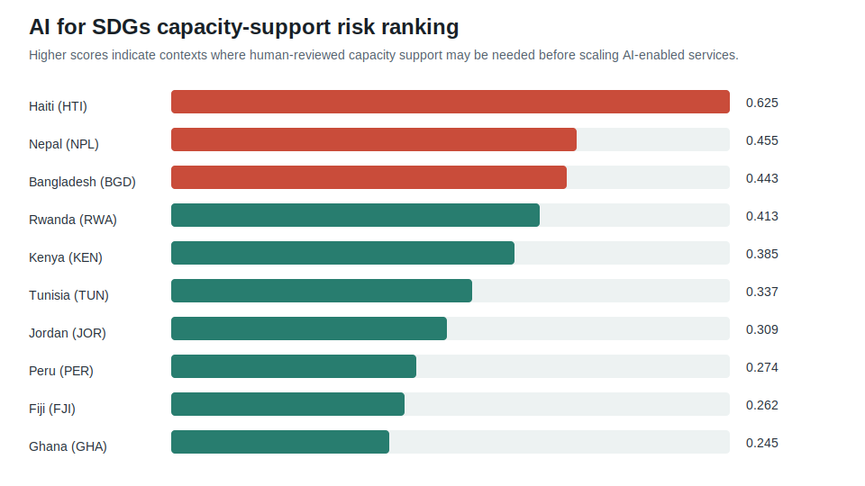
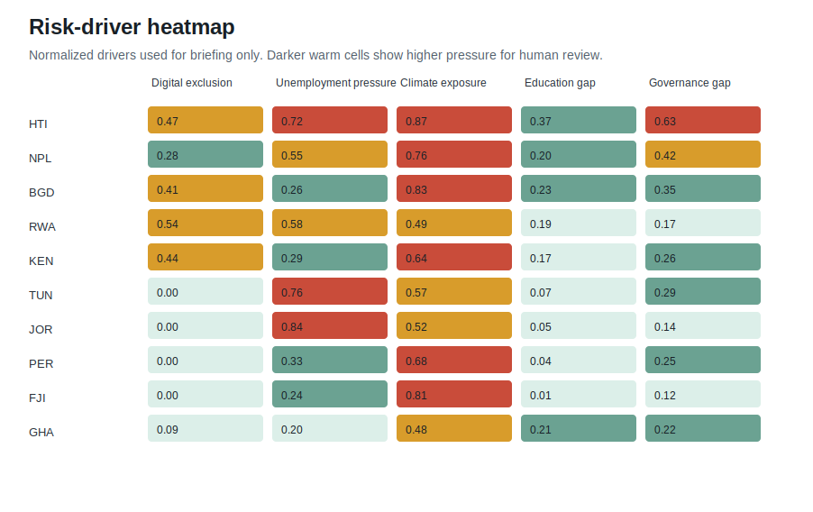

# Policy Brief: AI for SDGs Capacity Support

## Executive Summary

Artificial intelligence can accelerate progress on the Sustainable Development Goals when it is designed around public value, local capability, accountable institutions, and clear safeguards. It can also amplify exclusion when digital systems are introduced faster than the surrounding data, governance, skills, and oversight capacity. This brief uses a small offline public-development-style sample to show how an AI-for-SDGs team could structure an early screening conversation before scaling AI-enabled public service analytics. The sample is not a UNDP dataset and must not be used for resource allocation. Its purpose is to demonstrate the policy discipline around responsible data use, not to rank countries or make operational decisions.

The repository pipeline reviewed 10 country-context rows and flagged 3 contexts for deeper capacity-support review. The average briefing score is 0.375. The highest scores in the sample are HTI, NPL, BGD. These signals should be read as prompts for human discussion: where are connectivity gaps likely to limit inclusive access, where might youth employment or institutional capacity affect implementation, and where does climate exposure require continuity planning before digital services become critical infrastructure?

## Policy Context

UNDP's Digital Strategy frames digital transformation as an empowering force for people and planet, while emphasizing inclusive and resilient digital ecosystems. UNDP's public AI for Sustainable Development material similarly positions responsible and equitable AI as a potential accelerator for the SDGs when countries can participate in shaping and governing the technology. The policy challenge is therefore not whether AI can be useful. The challenge is how to sequence AI adoption so that it strengthens public capability instead of creating new dependency, opacity, or exclusion.

For SDG delivery, the most valuable near-term AI applications are often practical and unglamorous: better translation and access to public information, earlier detection of service bottlenecks, climate-risk triage, document classification, geospatial prioritization, fraud and leakage monitoring with safeguards, and knowledge support for frontline teams. These use cases can improve the speed and quality of decisions, but they sit close to sensitive public services. They require strong human oversight, privacy review, explainability appropriate to the audience, and mechanisms for people or communities to contest errors.

## Evidence Method

The mini lab combines structured indicators with simple text signals. Structured variables include internet usage, unemployment, climate exposure, education, and governance signals. A deterministic score gives higher weight to low connectivity and climate exposure, then unemployment, governance, and education gaps. Text notes are processed through lightweight keyword or TF-IDF extraction to surface themes such as connectivity, climate, privacy, monitoring, crisis, unemployment, and governance. The resulting score is a briefing aid only. It is intentionally simple enough for a policy reviewer to inspect and challenge.

This method has three advantages for a portfolio-style public sector workflow. First, it separates data preparation from policy interpretation, so the score never becomes a hidden decision rule. Second, it makes uncertainty visible by showing the drivers behind each flag. Third, it creates a repeatable template for asking better questions before a pilot scales: Which data are stale? Which groups are missing? Which public office owns the risk? Which harms would be unacceptable? Which benefits would justify a pilot?

## Sample Findings

| Context | Briefing score | Internet usage | Unemployment | Climate exposure | Text signal keywords |
| --- | ---: | ---: | ---: | ---: | --- |
| HTI | 0.625 | 39.8% | 14.5% | 8.7 | conditions;crisis;require;review |
| NPL | 0.455 | 54.0% | 10.9% | 7.6 | complicate;delivery;connectivity;climate |
| BGD | 0.443 | 44.5% | 5.1% | 8.3 | analytics;digital;exposure;service |
| RWA | 0.413 | 34.4% | 11.7% | 4.9 | capacity;monitoring;data |
| KEN | 0.385 | 42.1% | 5.7% | 6.4 | connectivity;gaps;local;need |

The flagged contexts share different risk profiles. Haiti combines low connectivity, high unemployment, high climate exposure, and weak governance signals, which points toward basic institutional and resilience support before introducing AI-enabled service workflows. Nepal and Bangladesh show strong climate and connectivity pressures, suggesting that digital services should be designed for intermittent access and disaster continuity. Jordan and Tunisia have comparatively stronger connectivity but high unemployment pressure, which points toward skills, labour-market inclusion, and stakeholder coordination rather than only infrastructure.

The heatmap matters more than the rank order. A single score can hide why a context is difficult. Climate exposure calls for resilience planning, data backups, and continuity protocols. Digital exclusion calls for offline channels, assisted access, language support, and accessibility testing. Governance gaps call for oversight, procurement discipline, audit trails, and clear accountability. Unemployment pressure calls for skills pathways and public communication so that AI pilots do not appear to automate services without creating local capability.

## Policy Implications

The first implication is that AI-for-SDGs work should begin with capacity diagnostics, not model selection. A pilot that works in a high-connectivity context may fail in a setting with weak access, fragile institutions, or climate disruption. Programme teams should document the minimum enabling conditions for each AI use case: data quality, legal basis, infrastructure, local skills, institutional owner, grievance route, and monitoring plan. If those conditions are absent, the correct intervention may be training, data stewardship, procurement support, or digital public infrastructure rather than an AI model.

The second implication is that responsible AI requires differentiated support. In contexts where connectivity is the main barrier, investment should prioritize inclusive access, low-bandwidth design, and assisted service channels. Where governance is the main barrier, the priority should be transparent procurement, documentation, auditability, and public accountability. Where climate exposure is high, the priority should be resilience: backup processes, continuity planning, and designs that do not make vulnerable communities dependent on fragile digital channels during crisis events.

The third implication is that SDG alignment should be specific. "AI for good" is too broad to guide implementation. A useful policy brief should name the SDG pathway, the decision being supported, the affected groups, the expected benefit, the risks, and the evidence standard. For example, an AI tool for climate service triage should be evaluated against resilience, inclusion, and response-time outcomes. A text-mining tool for policy documents should be evaluated against transparency, error review, and staff productivity. A chatbot for public services should be evaluated against accessibility, privacy, escalation quality, and user trust.

## Governance Guardrails

Any AI-for-SDGs pilot should have a written intended purpose and a prohibited-use list. In this lab, prohibited uses are aid allocation, eligibility, procurement decisions, sanctions, ranking people, or automated policy decisions. A real programme should also require data protection review, human oversight assignment, model and dataset documentation, procurement transparency, cyber review, and clear escalation paths. Affected communities should know when AI is being used, what it does not decide, how errors can be reported, and who is accountable for remedy.

Human review must be meaningful. It is not enough to say that a person remains "in the loop" if the workflow gives them no time, authority, training, or alternative evidence. Oversight should include the power to override, request more information, pause a pilot, and escalate harm. Review logs should capture the reason for a decision, the evidence considered, and any uncertainty. For public-sector contexts, this is also a trust issue: people need to see that digital transformation is accountable to public purpose rather than optimized only for speed.

## Implementation Roadmap

In the first 30 days, a programme team should map use cases, data sources, affected groups, and institutional owners. It should identify which use cases are low-risk productivity aids and which could affect rights, services, or vulnerable groups. It should also create a data inventory and a brief AI literacy module for staff who will supervise pilots.

In 60 to 90 days, the team should run a small capacity diagnostic for priority use cases. The diagnostic should review data quality, connectivity, language coverage, privacy, procurement needs, cybersecurity, local skills, and continuity plans. It should produce a go, hold, or redesign recommendation. The output should be a discussion brief, not an automated scorecard.

Within 6 months, pilots should have model cards or system cards, monitoring indicators, incident-response templates, and user feedback channels. The strongest pilots will be those that improve human capability: analysts can review more evidence, public servants can respond faster, and communities can access services more fairly. The weakest pilots will be those that hide fragile data behind a confident interface.

## Limits and Next Steps

This brief is based on a small synthetic-style sample and simplified indicators. It does not include country-office validation, disaggregated demographic analysis, legal review, procurement analysis, or live public data refresh. The next iteration should connect to verified public sources, add metadata for freshness and licensing, include gender and disability inclusion checks, and test whether recommendations change under missing data or alternative weights. The goal is not a more impressive score. The goal is a more accountable conversation about when AI helps advance the SDGs and when foundational capacity must come first.

## Public Sources

- UNDP AI for Sustainable Development: https://www.undp.org/digital/ai
- UNDP Digital Strategy 2022-2025: https://www.undp.org/publications/digital-strategy-2022-2025
- UNDP Strategic Plan 2022-2025: https://strategicplan.undp.org/2022-2025/
- UNDP Data Futures Platform: https://sdgintegration.undp.org/data-futures-platform
